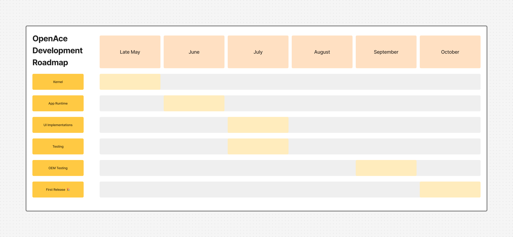

# OpenAce

OpenAce is a lightweight, modular base operating system developed by Weno. Designed to replace Android on AceUI-powered devices, OpenAce provides a secure, efficient, and customizable platform for embedded and mobile systems.

## 🚀 What's New in 0.4 "Cheesecake"

- **Apps:** We've added more essential applications to make your device usable.
- **APIs** More APIs for more functionalities on OpenAce. APIs use the WebCpp framework to run, you can use APIs to make your apps more usable to your clients.

These foundational UI improvements mark a major step forward in making OpenAce a daily-driver-ready platform for AceUI devices.

## Features
- Minimal, fast, and resource-efficient core
- Modular architecture for easy customization
- Secure kernel and system services
- Integrated with AceUI for a modern user experience
- Support for a wide range of hardware via device drivers

## Development Roadmap
We have provided a development Roadmap below:

## Integrating OpenAce into Your ROM
OpenAce is designed to be easily integrated into custom ROMs. ROM developers do **not** need to clone the entire OpenAce repository. Instead, you only need to integrate the in-development OpenAce API into your ROM project to extend, customize, and interact with the OS at various levels.

### Steps to Integrate OpenAce
1. **Integrate the OpenAce API**
   - Add the OpenAce API (currently in development) as a dependency in your ROM project. Refer to the `docs/` directory for the latest API updates and integration instructions.
2. **Configure Device Support**
   - Add your device configuration under the `device/` directory. Use `device/weno/` as a reference.
3. **Build OpenAce**
   - Use the scripts in the `build/` directory to compile OpenAce for your target hardware.
4. **Integrate AceUI**
   - AceUI is the default UI layer. Customize it in the `ui/` directory to match your ROM's branding and features.
5. **Use the OpenAce API**
   - The OpenAce API will provide hooks and interfaces for ROM-level customization, system service integration, and hardware abstraction. Refer to the `docs/` directory for API updates and usage examples as development progresses.

> **Note:** The OpenAce API is under active development. Stay tuned for updates and detailed integration guides in future releases.

## Getting Started
1. **Build OpenAce**
   - Follow the instructions in the `build/` directory to compile the OS for your target device.
2. **Device Integration**
   - Configure your device in the `device/` directory. Reference examples under `device/weno/`.
3. **Boot Process**
   - The bootloader and kernel sources are in `kernel/`. See `arch/aarch64/` for ARM64 support.
4. **UI Layer**
   - AceUI is the default user interface. Customize it in the `ui/` directory.

## Directory Structure
- `aceboot/` — Bootloader and initialization
- `base/` — Core system libraries
- `build/` — Build scripts and configuration
- `device/` — Device-specific configuration and code
- `drivers/` — Hardware drivers
- `kernel/` — Kernel source code
- `packages/` — Optional system packages
- `system/` — System services and daemons
- `tools/` — Development and debugging tools
- `ui/` — AceUI user interface

## Documentation
See the `docs/` directory and in-source comments for further documentation.

## License
OpenAce is released under the MIT License. See `LICENSE` for details.

